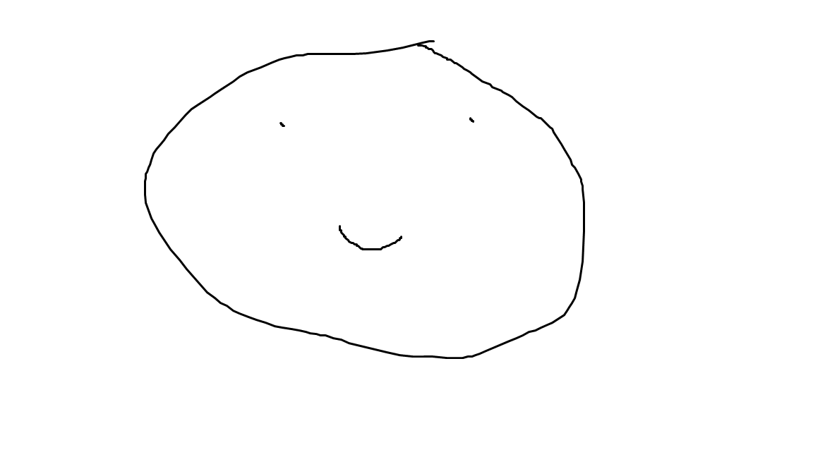

<!DOCTYPE html>
<html>
<title>Brandon Wenaas - Sample Web Page</title>
<body>
	<h1 style="text-align: center;">Header</h1>
</body>
</html>

This is a paragraph. V̇O2 is an important measure of athletic capacity.
 |   
--- | ---  
<a style="font-weight:bold" href="sitesubfolder/readme.md" target="_blank">open readme file</a> | 

[//]: # (Need a Centred Title, Picture, Colour text, hyperlink to readme.md)
